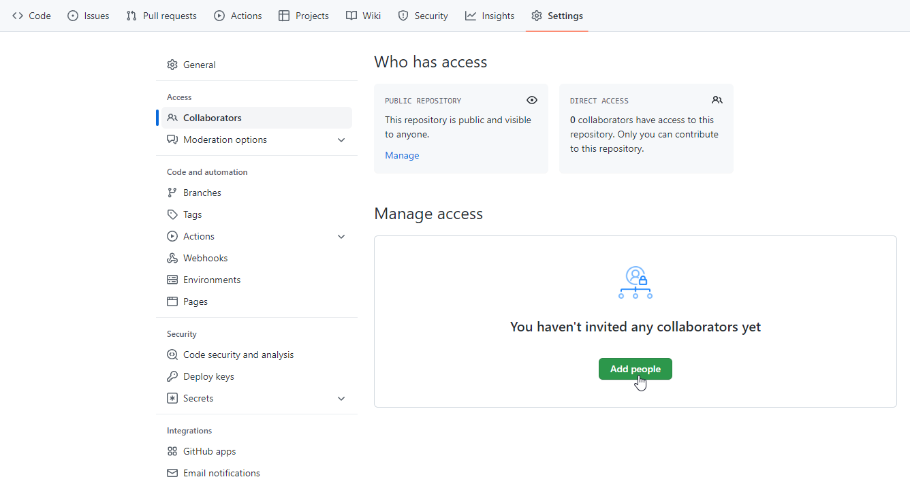
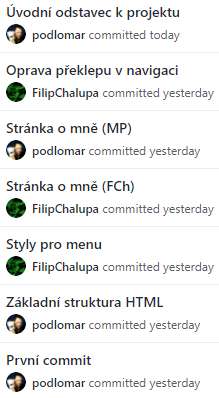
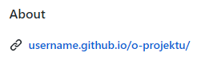

# Úkol: O projektu

Vyrobte webovou stránku, kde představíte sebe a svůj závěrečný projekt. Web může být velmi jednoduchý, stačí vaše jména třeba s odkazem na GitHub a popis projektu. Přidejte nějaké stylování. Můžete (nepovinně) obsah obohatit o i nějaké obrázky.

## Zadání

V tomto úkolu nebudete používat Vite, protože s ním si GitHub Pages neporadí. Pro vývoj použijete `npx serve`, který znáte z lekcí HTML/CSS a JavaScript 1.

- Pracujte ve dvojicích podle vašeho týmu pro závěrečný projekt (nebo samostatně, pokud závěrečný projekt děláš sama). Založte na GitHubu repozitář `o-projektu` u jedné z vás, tu druhou si pozvěte jako spolupracovnici (záložka `Settings` > `Collaborators` > `Add people`).

  

- Jedna z vás založí lokálně nový projekt pomocí
  ```shell
  npx ini kodim-app@latest o-aplikaci html-css-js
  ```
  To založí nový projekt s HTML, CSS a JavaScriptem ve složce `o-projektu`.

- V prázdném repozitáři na GitHubu je popsaná sekvence příkazů, jak váš projekt na lokálním počítači napojit na GitHub repository. Začíná příkazem `git init`. Tuto sekvenci příkazů proveďte. Nemusíte vytvářet nový souboru `README.md`, místo něj do repository přidejte soubory, které vytvořil příkaz `npm init`.

- Zkontrolujte, že máte soubory tvořící projekt nahrané i v repository na GitHubu. Nyní si projekt může naklonovat i vaše parťačka z projektu.

- Rozvrhněte si práci tak, aby každá z vás udělala aspoň pár commitů ze svého počítače a v historii jste se několikrát prostřídaly. Nezapomeňte práci průběžně nahrávat na GitHub přes `git push` a stahovat k sobě nové změny přes `git pull`.

  

- Použijte minimálně tři HTML soubory, které budou spolu provázané přes odkazy `<a href="_____.html">` tak, aby se z každé stránky dalo dostat na zbylé dvě. Použijte relativní odkazy.

  - Pro odkazy navrhněte vzhled a strukturu společného menu, které bude na všech stránkách stejné.
  - Jednu stránku věnujte informacím o projektu, který chcete v rámci akademie společně vytvořit. Stačí název a jeden odstavec textu.
  - Zbylé dvě nebo tři stránky, podle toho, kolik vás je, věnujte vám. Zmiňte na nich například vaše jméno a odkaz na GitHub účet.

- Styly si můžete napsat kompletně vlastní nebo vycházet z libovolného frameworku jako je například [Bootstrap](https://getbootstrap.com/).

- Výsledný web zveřejněte pomocí GitHub Pages a odkaz na něj dejte do sekce GitHub popisku `About`.

  

- Výše je popsané minimum pro splnění úkolu. Neváhejte web jakkoliv rozšířit. Má vám primárně sloužit pro nacvičení práce v týmu, ale může z něj klidně vzniknout plnohodnotný web o webu, web o projektu. Můžete se rozepsat o tom, proč jste si dané téma vybraly. Přiložit wireframy, skici, návrhy designu. Časem doplnit odkaz na hotový projekt a jeho zdrojové kódy.
